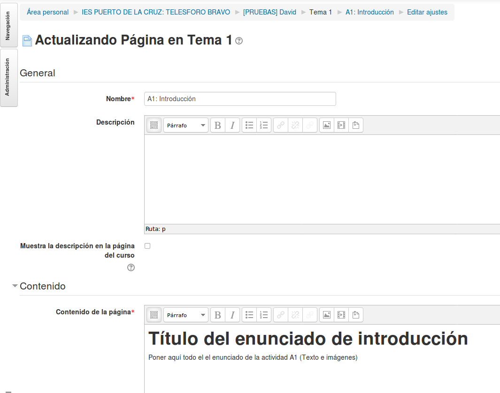
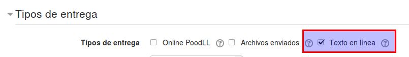
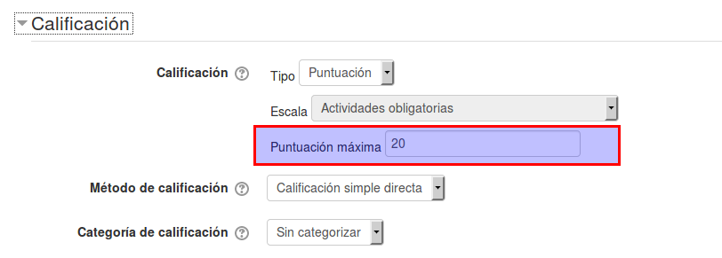
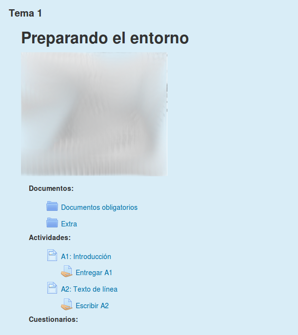

# Tareas para el tema 1

Por ahora tenemos un curso vacío con dos alumnos. Ahora vamos a empezar a crear algunas actividades para ponerles notas.

En Moodle las actividades en las que el alumno debe entregar un trabajo (producto) al profesor, reciben el nombre de `Tareas`

> **NOTA**
>
> Los enunciados de las actividades, en general suelen tener cierto tamaño, además de incluir imágenes. Por ese motivo es conveniente poner los enunciados en recursos de `Página`.
>
> No ponemos el enunciado en la tarea porque el campo que tiene es demasiado corto.

---

## Ejercicio A1: Subir fichero

Vamos a crear un ejercicio para los alumnos, donde tienen que entregarnos un archivo digital.
* Ir a `Administración -> Activar edición`.
* Ir a la caja 1.
* Agregar recurso `Página`.
* Mover el recurso debajo de la etiqueta `Actividades:`
* Sangrado derecha de 1.
* Configurar con:
    * Nombre: `A1: nombre de la actividad`
    * Contenido: Escribir un enunciado para la actividad A1. Incluir imágenes si es posible.

> 

Ahora creamos una Tarea:
* Agregar actividad `Tarea`.
* Mover el recurso debajo del enunciado.
* Sangrado derecha de 2.

Configurar la tarea con:
* Nombre: `Entregar A1`
* Descripción: Indicar cómo se hará la entrega. Esto es, un fichero en formato PDF, o una imagen PNG, un ZIP, etc.
* Tipo de entrega: Marcar `Archivos enviados`
* Calificación
    * Puntuación máxima: `10`

> Habitualmente solemos calificar de 0 a 10, como en esta tarea. Pero esto no tiene porqué ser siempre de así.

---

## Ejercicio A2: Texto en línea

Vamos a crear un ejercicio para los alumnos, donde tienen que escribir un texto directamente en el Moodle.
* Ir a `Administración -> Activar edición`.
* Ir a la caja 1.
* Agregar recurso `Página`.
* Mover el recurso debajo de la actividad A1.
* Sangrado derecha de 1.
* Configurar con:
    * Nombre: `A2: nombre de la actividad`
    * Contenido: Escribir un enunciado para la actividad A2. Incluir imágenes si es posible.

Creamos una tarea:
* Agregar actividad `Tarea`.
* Mover el recurso debajo del enunciado.
* Sangrado derecha de 2.

Configurar la tarea con:
* Nombre: `Entregar A2`
* Descripción: Indicar que se debe escribir la respuesta que se busca.
* Tipo de entrega: Marcar solamente `Texto en línea`

> 

* Calificación
    * Puntuación máxima: `20`

> 

> En este caso calificaremos de 0 a 20. De entrada puede parecer extraño, pero en algunos casos es útil.
>
> ¿Pero cómo unificamos puntuaciones de 0-10 con puntuaciones de 0-20?
> No te preocupes. Veremos cómo Moodle nos normaliza todas las puntuaciones para que mantengan un sistema equivalente. ;-)

---

Debemos tener algo como lo siguiente:

> 
