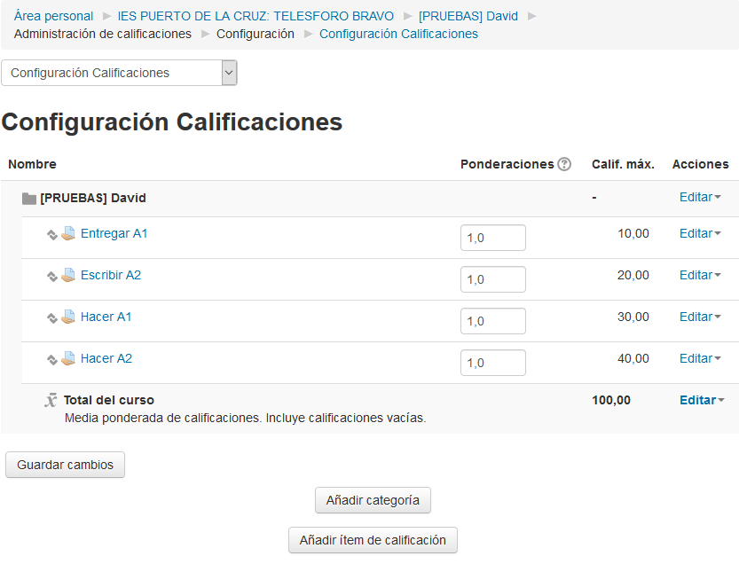
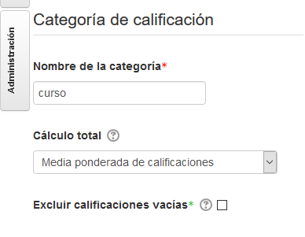
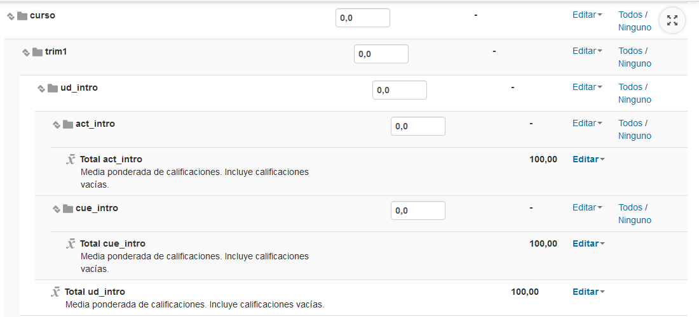
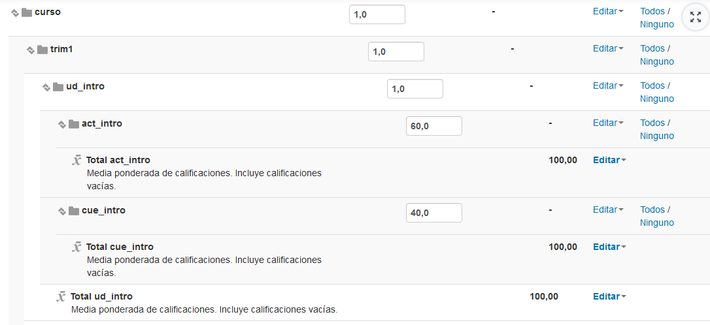
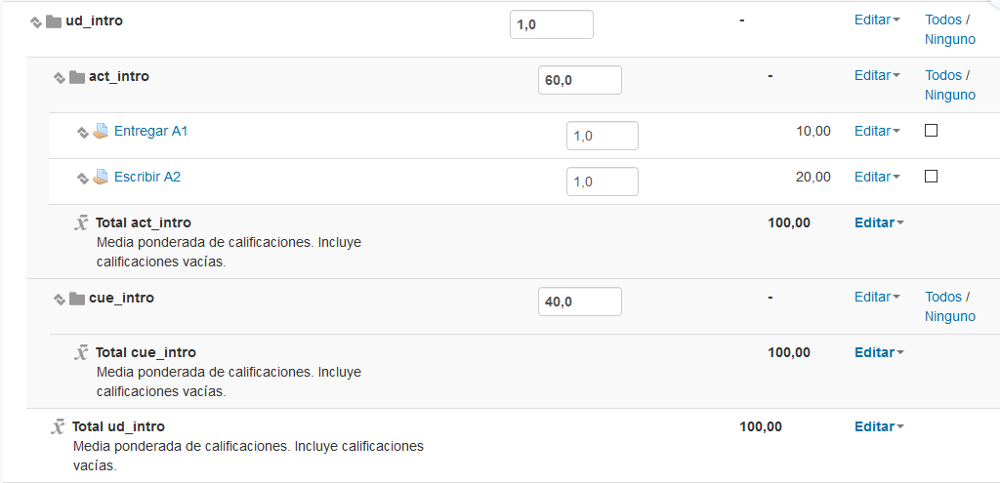
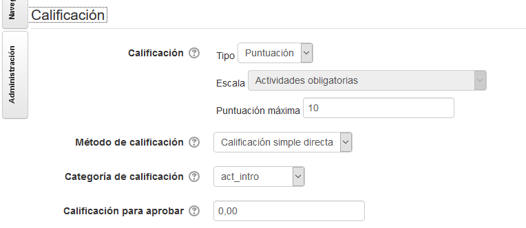

# Calificador

Los cursos que hacemos en Moodle (Como Campus Virtual o EVAGD) tienen un sistema para llevar las calificaciones. De esta forma, no es necesario llevar el control de notas en una hoja de cálculo externa.

**Supuesto**

Vamos a crear una configuración del calificador para resolver el siguiente supuesto. Queremos tener notas/calificaciones en lo siguiente:
* Trim1 y trim2.
* Tema 1 y 2 dentro de trim1.
* Tema 3 y 4 dentro de trim2.
* Cada una de las partes de actividades y cuestionarios de cada uno de los temas.

Además suponemos los siguiente pesos:
* Todos los trimestres tienen el mismo peso.
* Todas las unidades didácticas tienen el mismo peso.
* Dentro de cada unidad:
    * Las actividades tendrán un peso de 60%
    * Las cuestionarios tendrán un peso de 40%.

## Pasos

Los pasos que vamos a seguir son:
1. Crear las categorías
2. Configurar las categorías
3. Mover cada tarea dentro de su categoría
4. Comprobar los resultados

Si entramos ahora en `Menú izquierdo -> Administración -> Configuración de calificacion` veremos todas las tareas (actividades) que habíamos creado como si fuera una lista. Esto lo vamos a cambiar.

> Ver ejemplo:
>
> 

---

# 1. Crear las categorías

* Ir a `Campus Virtual`. Entrar en nuestro curso de pruebas.
* A la derecha `Administración -> Configuración Calificaciones`.
* `Añadir categoría` con:

| Campo  | Valor | Descripción |
| ------ | ----- | ----------- |
| Nombre | `curso` ||
|Cálculo total | `Media ponderada de calificaciones` | **Esta parte es MUY IMPORTANTE!!!**. Establece el sistema de pesos que vamos a usar |
| Total categoría -> Calificación para aprobar | `50` | Estamos definiendo que todo lo que sea superior a 50% lo pinte en verde y y es inferior lo ponga en rojo |
| Mostrar calificación | Porcentaje ||

> Ver ejemplo:
>
> 

* `Añadir categoría` con:

| Campo  | Valor   | Descripción |
| ------ | ------- | ----------- |
| Nombre | `trim1` ||
|Cálculo total | `Media ponderada de calificaciones` | **Esta parte es MUY IMPORTANTE!!!**. Establece el sistema de pesos que vamos a usar |
| Total categoría -> Calificación para aprobar | `50` | Estamos definiendo que todo lo que sea superior a 50% lo pinte en verde y y es inferior lo ponga en rojo |
| Mostrar calificación | Poercentaje ||
| Categoría padre | `curso` | Nombre de la categoría de nivel superior |

> Veamos imagen de ejemplo:
>
> 

---

## Seguimos creando categorías

* Seguimos así, hasta obtener la siguiente estructura:

```
curso
  ├───trim1
  │   ├───ud_intro
  │   │   ├───act_intro
  │   │   └───cue_intro
  │   └───ud_rojo
  │       ├───act_rojo
  │       └───cue_rojo
  └───trim2
      ├───ud_verde
      │   ├───act_verde
      │   └───cue_verde
      └───ud_azul
          ├───act_azul
          └───cue_azul
```

Las categorías las hemos creado con nombres "extraños" en principio. Por ejemplo, la unidad didáctica azul, tiene una categoría `ud_azul` y las actividades de la unidad didáctica verde se llama `act_verde`, mientras que los cuestionarios de la unidad didáctica roja tienen el nombre `cua_roja`.

> ¿Tiene algún sentido?... Sí. Espera que lo veremos más adelante.

---

# 2. Configurar cada categoría

* Ir a `Administración -> Configurar calificaciones`
* Poner los pesos de cada categoría.
    * Poner peso 1 a: curso, trim1, trim2, ud_intro, ud_rojo, ud_verde y ud_azul.
    * Poner peso 60 a: act_intro, act_rojo, act_verde y act_azul.
    * Poner peso 40 a: pru_intro, pru_rojo, pru_verde y pru_azul.
* Grabar

> Ver ejemplo:
>
> 

Los pesos que se ponen a las categorías son relativos. Esto quiere decir que para hacer una distribución de pesos equitativa entre varias categorías (Media artimética) podemos poner los pesos 1, 1 y 1 a todas o  2, 2 y 2... Todas con el mismo peso. Moodle sabe hacer el cálculo.

Si queremos hacer una distribución 60% y 40% podemos poner como pesos 60 y 40, o 6 y 4, o 3 y 2, etc. Otra vez, Moodle sabrá hacer los cálculos.

> Es importante que tengamos puesta la fórmula "Pesos ponderados". Esa es la nuestra. NO USAR la fórmula "Pesos ponderados simples"... ¡Esa fórmula no la usamos!.

---

# 3. Mover cada tarea a su categoría

Se puede comprobar que las tareas aparecen en esta pantalla, pero están fuera de las categorías que acabamos de crear.
* Mover cada tarea (actividad) a su categoría correspondiente. Deben estar 2 tareas en `act_intro` y 2 tareas en `act_rojo`. Esto es, organizar las actividades/tareas de los temas 1 y 2 en sus categorías correspondientes.

> Ver ejemplo:
>
> 
>
> Podemos comprobar que el resto de categorías están vacías... por el momento.

Otra forma de configurar cada tarea dentro de su categoría es:
* Ir a la página principal del curso Moodle.
* Activar edición.
* Configurar `ajustes de la tarea/actividad -> Configurar categoría`. Ahí nos aparece un desplegable con las etiquetas o los nombres de las categorías de calificación que hemos creado.

> Ver ejemplo:
>
> 
>
> La forma de nombrar las categorías, es para facilitar la localización de las categorías que necesitamos en cada momento.

* Aprovecharemos para configurar en cada tarea, el parámetro `Calificación para aprobar`. Pondremos en cada caso el valor numérico mínimo que suponga que se puede considerar la actividad aprobada. Configurar esta opción implica que mas tarde veremos coloreado en rojo/verde las notas de los alumnos si se considera que están suspedidos/aprobados. ¡Esto ayuda mucho!

---

# 4. Comprobar los resultados

Ahora para poder comprobar que la fórmula de nuestro calificador está bien configurada vamos a poner notas a las tareas de los alumnos. Se puede hace de varias formas, pero ahora para empezar los haremos así:
* Ir a la página principal del curso.
* Ir a la caja 1. Entrar en A1.
* Calificar al alumno A con la nota máxima y al alumno B con la mitad.
* Ir a la caja 1. Entrar en A2.
* Calificar al alumno A con la nota máxima y al alumno B con la mitad.
* Ir a la página principal del curso.
* Ir a la caja 2. Entrar en A1.
* Calificar al alumno A con la nota media y al alumno B con 0.
* Ir a la página principal del curso.
* Ir a la caja 2. Entrar en A2.
* Calificar al alumno A con la nota media y al alumno B con 0.

Seguimos.
* Ahora vamos a `Administración -> Calificaciones`. Se tiene que mostrar una especie de hoja de cálculo con una fila por alumno y columnas por cada tareas/actividad.
* Comprobar que las categorías están siendo correctamente calculadas.
* Comprobar que aparecen en verde las notas aprobadas y en rojo las suspendidas.

---

# Notas "vacías"

Vemos que la categorías de cuestionario está vacía. Por tanto, no es posible calcular la nota de algo "vacío". No es cero, porque no se ha hecho nada.

Para cambiar este comportamiento podemos configurar las categorías para que se consideren las notas "vacías" o nula como si fuera un cero. ¡Hagámoslo!

