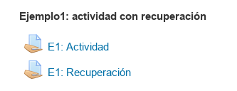
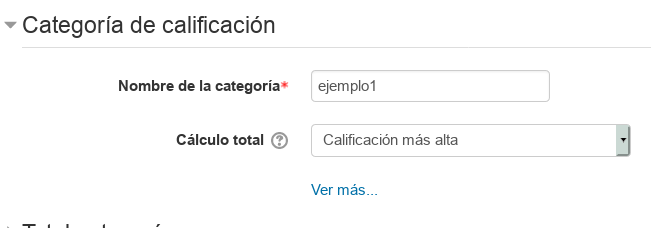
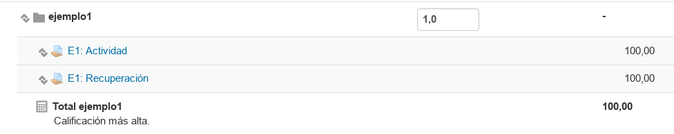

# Preguntas, dudas y ejemplos

---

# Ejemplo 1

Pregunta:
```
Imaginemos el caso de que
se crea una tarea para poner la nota de un examen
y luego se crea otra tarea
para poner la nota de la recuperación de esa unidad.

¿Cómo coger la nota más alta entre dos tareas?
```

Respuesta:

> Una forma es usar las categorías del calificador con la fórmula escoger la mayor. Veamos:

**Paso 1:** Creamos las dos tareas: (a) La actividad y (b) la recuperación.

> 

**Paso 2:** Ir al calificador y crear la categoría `ejemplo1`

> 

**Paso 3:** Dentro del calificador, colocamos las tareas en la categoría `ejemplo1`.

>

Fijarse que la fórmula de cálculo es `Calificación más alta`

Si vamos al informa del calificador, después de haber puesto algunas notas, veremos algo como lo siguiente:
* El alumno1, no necesita recuperar.
* El alumno2, recupera y se queda con la nota de la recuperación.

> 

---

# Ejemplo 2

```
¿Cómo gestionamos las actividades de recuperación
en el siguiente supuesto?

* Tenemos 3 unidades (u1, u2 y u3)
* Cada unidad tiene su examen (e1, e2 y e3) y
* Además haces recuperación de cada unidad (r1, r2, y r3) Sólo a los alumnos que no hayan superado su correspondiente examen, evidentemente.
```

Se me ocurren 3 formas de plantearlo:
* (a) Usar la solución propuesta en EJEMPLO1.
* (b) Si e1=r1 y e2=r2 y e3=r3. Sólo es repetir la actividad y "machacar" la nota.
* (c) Leer esta propuesta...

**Paso 1:** Crear tareas `Recuperación1`, `Recuperación2` y `Recuperación3`.

**Paso 2:** Ir al calificador y ponerlas con peso 0 para que no se tengan en cuenta en la evaluación.

**Paso 3:** Ir al calificador, activar edición y modificar la nota manualmente, de la unidad recuperada, y sólo para el alumno necesario.
