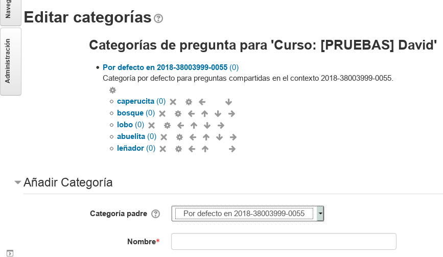
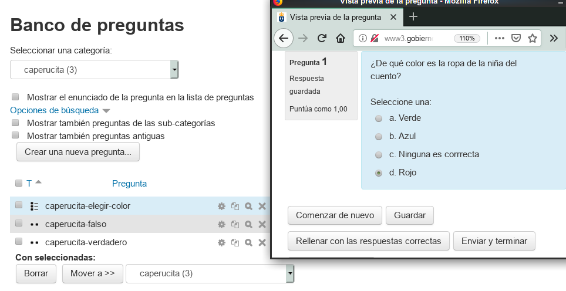
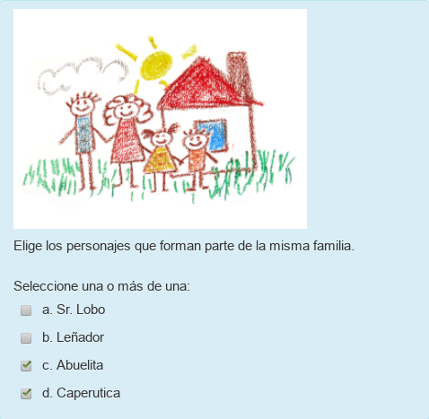

# Las preguntas

## Los cuestionarios

Los cuestionarios son una actividad de Moodle que muestra al alumno una serie de preguntas tipo test (verdadero/falso, elección, respuesta corta, etc.) que tiene que responder. La gran ventaja de los cuestionarios es que se corrigen automáticamente una vez se cierra el cuestionario. De esta forma, el feedback que recibe el alumno es inmediato.

A todos nos parece una buena ventaja, pero hay dos inconvenientes:
1. Se tarda cierto tiempo en hacer la preguntas apropiadas para el cuestionario.
2. Los cuestionarios son sólo adecuados para usar en ejercicios donde las respuestas/soluciones están acotadas, cerradas o concretas. No siempre es posible, ni sencillo convertir una actividad abierta en una actividad cerrada.

Posibles soluciones a los inconvenientes anteriores:
1. Las preguntas las vamos a ir haciendo poco a poco. Cuando tengamos suficientes ya podemos hacer un cuestionario.
2. Todos los aspectos teóricos o memorísticos (si los hubiera) son muy apropiados para pasarlos a un cuestionario.

---

## El banco de preguntas

Antes de hacer un cuestionario tenemos que empezar a crear preguntas. Las preguntas se crean dentro del "banco de preguntas" y luego se usan en los cuestionarios. De esta forma podemos reutilizar las preguntas en tanto cuestionarios como queramos.

El banco de preguntas se nos va a llenar enseguida de muchas preguntas. Para llevar una gestión más sencilla es conveniente organizar las preguntas en categorías. Así que vamos a crear las categorías antes que las preguntas.

> NOTA: No uses nombre de categorías como tema1, tema2, etc. o unidad1, unidad2, etc. porque la secuenciación puede cambiar n cualquier momento.

---

## Supuesto: Caperucita roja

En mis ejemplos voy a a suponer que tengo que crear preguntas sobre el cuento de "Caperucita roja". Por tanto, voy a crear las categorías siguientes: caperucita, bosque, lobo, abuelita y leñador. Ustedes deben elegir su propio tema y escoger las categorías adecuadas para el mismo. No pasa nada si más adelante cambiamos de opinión y queremos modificar lo que habíamos hecho.

* Ir `Administración -> Banco de preguntas -> Categorías`
* Crear las categorías, poniendo un nombre adecuado (Que no sea muy largo). No es obligatorio poner la descripción.

Con las flechas podemos ordenar las categorías. O mover una dentro de otra. El orden de las categorías no tiene ningún efecto, salvo el de tener el banco de preguntas ordenado.

> 
>
> Puede ser buena idea secuenciar las categorías siguiendo el orden en el que las vamos a usar.

---

## Preguntas: verdadero

* Ir `Administración -> Banco de preguntas -> Preguntas`
* Eligir la categoría (donde se guardará la pregunta que vamos a crear).
* `Crear nueva pregunta`
* Elegir tipo `verdadero/falso`

Rellenar con lo siguiente:

| Campo     | Valor                      | Descripción |
| --------- | -------------------------- | ----------- |
| Nombre    | caperucita-color-rojo      | El nombre debe ser un texto que nos ayude a identificar la pregunta. NO es la pregunta |
| Enunciado | Caperucita es una niña que tiene la ropa de color rojo | Ésta si es la pregunta. En este caso es una afirmación, porque el de tipo verdadero/falso |
| Respuesta correcta | verdadero | Es el valor que hay que responder para acertar |

* `Guardar cambios`
* Las primeras veces conviene pinchar en la lupa para abrir una demo y ver qué tal ha quedado nuestra pregunta.

> 

---

## Preguntas: falso

* Ahora crearemos una pregunta V/F donde la respuesta sea falso.

---

## Preguntas de opción múltiple (1 correcta)

En este tipo de preguntas le ofrecemos al alumno varias opciones y tiene que elegir la correcta. Normalmente la correcta es una, pero pueden ser varias. Veremos ambos ejemplos.

* Ir a `Administración -> Banco de preguntas -> Preguntas`
* Elegir la misma categoría.
* `Crear nueva pregunta`
* Elegir el tipo `Opción múltiple`

Rellenar con lo siguiente:

| Campo     | Valor                      | Descripción |
| --------- | -------------------------- | ----------- |
| Nombre    | caperucita-elegir-color    | El nombre debe ser un texto que nos ayude a identificar la pregunta. NO es la pregunta |
| Enunciado | ¿De qué color es la ropa de la niña del cuento? | Ésta si es la pregunta. |
| ¿Una o varias respuestas | Sólo una | Sólo hay una respuesta correcta |
| ¿Barajar respuestas? | Sí | Las opciones saldrán en diferente orden cada vez que se muestre la pregunta a diferentes alumnos |
| Elección 1 | Rojo ||
| Calificación 1 | 100% ||
| Elección 2 | Azul ||
| Calificación 2 | -25% ||
| Elección 3 | Rosa ||
| Calificación 3 | -25% ||
| Elección 4 | Ninguna es correcta ||
| Calificación 4 | -25% |.|

> 
>
> Las preguntas de elección múltiple, la creamos con 4 opciones (es lo más frecuente). La correcta tiene 100% y las incorrectas valoración negativa. De esta forma, las respuestas equivocadas restan puntos. Esto es para prevenir que no escojan respuestas al azar.

---

## Preguntas de opción múltiple (2 correctas)

En este tipo de preguntas le ofrecemos al alumno varias opciones y tiene que elegir todas las correctas.

* Ir a `Administración -> Banco de preguntas -> Preguntas`
* Elegir la misma categoría.
* `Crear nueva pregunta`
* Elegir el tipo `Opción múltiple`

Rellenar con lo siguiente:

| Campo     | Valor                      | Descripción |
| --------- | -------------------------- | ----------- |
| Nombre    | personajes-familia        | El nombre debe ser un texto que nos ayude a identificar la pregunta. NO es la pregunta |
| Enunciado | Elije los personajes que tienen una relación de parentesco entre sí. (Incluir una imagen de familia en el enunciado)| |
| ¿Una o varias respuestas | Se permiten varias | Elegir todas las respuestas correctas|
| ¿Barajar respuestas? | Sí | Las opciones saldrán en diferente orden cada vez que se muestre la pregunta a diferentes alumnos |
| Elección 1 | Caperucita ||
| Calificación 1 | 50% ||
| Elección 2 | Abuelita ||
| Calificación 2 | 50% ||
| Elección 3 | Leñador ||
| Calificación 3 | -50% ||
| Elección 4 | Lobo ||
| Calificación 4 | -50% |.|

> 
>
> Las puntuaciones negativas deben anular a las positivas.

---

# ¿Qué hay que hacer?

* Crear varias preguntas de los tipos anterior en tu propio curso Moodle.
