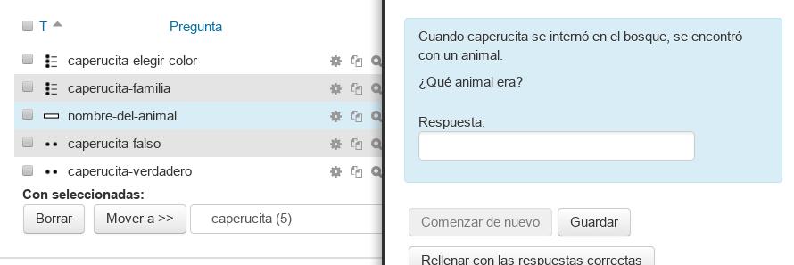
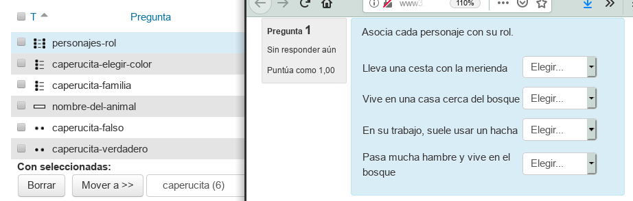

# Más preguntas

Vamos a probar con otros tipos de preguntas.

## Preguntas: respuesta corta

* Ir `Administración -> Banco de preguntas -> Preguntas`
* Eligir la categoría (donde se guardará la pregunta que vamos a crear).
* `Crear nueva pregunta`
* Elegir tipo `respuesta corta`

Rellenar con lo siguiente:

| Campo     | Valor                      | Descripción |
| --------- | -------------------------- | ----------- |
| Nombre    | nombre-del-animal          | El nombre debe ser un texto que nos ayude a identificar la pregunta. NO es la pregunta |
| Enunciado | Cuando caperucita se internó en el bosque, se encontró con un animal. ¿Qué animal era? | Ésta si es la pregunta. |
| Respuesta correcta | verdadero | Es el valor que hay que responder para acertar |
| Respuesta 1 | Lobo ||
| Calificación 1 | 100% ||
| Respuesta 2 | El lobo ||
| Calificación 2 | 100% ||
| Respuesta 3 | Un lobo ||
| Calificación 3 | 100% ||
| Respuesta 4 | lovo ||
| Calificación 4 | 25% |.|

* `Guardar cambios`
* Las primeras veces conviene pinchar en la lupa para abrir una demo y ver qué tal ha quedado nuestra pregunta.

> 

---

# Pregunta emparejamiento

* Ir `Administración -> Banco de preguntas -> Preguntas`
* Eligir la categoría (donde se guardará la pregunta que vamos a crear).
* `Crear nueva pregunta`
* Elegir tipo `emperejamiento`

Rellenar con lo siguiente:

| Campo     | Valor                      | Descripción |
| --------- | -------------------------- | ----------- |
| Nombre    | personajes-rol             | El nombre debe ser un texto que nos ayude a identificar la pregunta. NO es la pregunta |
| Enunciado | Asocia cada personaje con su rol. | Ésta si es la pregunta. |
| Respuesta correcta | verdadero | Es el valor que hay que responder para acertar |
| Pregunta 1 | Lleva una cesta con la merienda ||
| Respuesta 1  | Caperucita ||
| Pregunta 2 | Vive en una casa cerca del bosque ||
| Respuesta 2  | Abuelita ||
| Pregunta 3 | En su trabajo, suele usar un hacha ||
| Respuesta 3  | Leñador ||
| Pregunta 4 | Pasa mucha hambre y vive en el bosque ||
| Respuesta 4  | Lobo |.|

* `Guardar cambios`

> 

---

# ¿Qué hay que hacer?

* Crear varias preguntas de los tipos anterior en tu propio curso Moodle.
* Dependiendo de la materia se necesitarán unos tipos de preguntas u otros. Experimenta con otros tipos.
