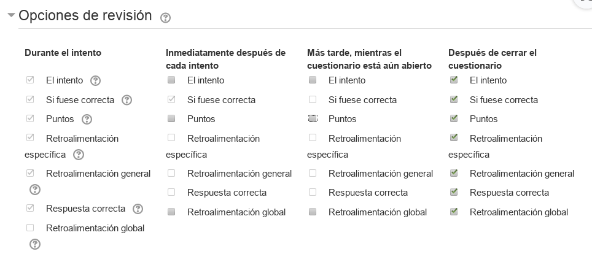
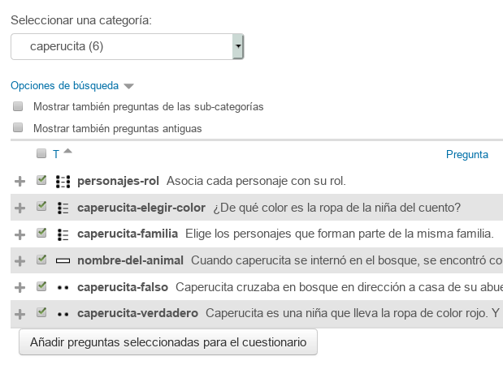
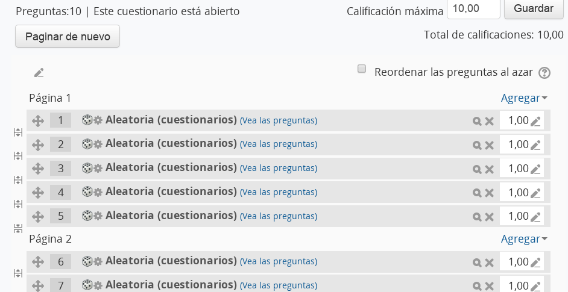
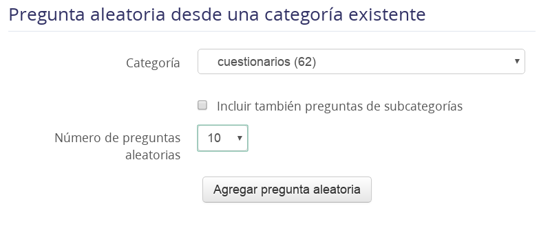

# Los cuestionarios

Las preguntas las hemos creado dentro del banco de preguntas, pero ahora necesitamos un cuestionario para usar las preguntas dentro de una actividad. Vamos allá.

---

# 1. Crear cuestionario: preguntas fijas

## 1.1 Cuestionario

* Ir a la página principal de nuestro curso de pruebas.
* Ir a la caja 1 (tema1).
* `Agregar actividad o recurso`
* Elegir actividad `cuestionario`

Rellenar con lo siguiente:

| Campo  | Valor            | Descripción |
| ------ | ---------------- | ----------- |
| Nombre | C1: cuestionario | Nombre corto para el cuestionario |
| Temporalización ||Establecer las fechas de inicio y fin |
| Calificación -> Categoría | cue_intro | Elegir la categoría del calificador |
| Calificación -> Intentos | 1 | Veces que se puede repetir la actividad
| Opciones de revisión | Marcar SOLO "Después de cerrar el cuestionario" | Momento en el cual se harán visibles los resultados |

> 

* `Guardar cambios y mostrar`

## 1.2 Incluir las preguntas

Ahora necesitamos añadir "preguntas" al cuestionario.

* `Editar cuestionario`
* `Agregar -> del banco de preguntas`
* `Seleccionar categoría`
* Seleccionar preguntas
* `Añadir preguntas seleccionadas al cuestionario`

> 

* `Paginar`
* `Repaginar con 5 preguntas por página -> Ir`.

> 
>
> Esto establece el número de preguntas que se mostrarán en cada página. El el alumno deberá ir saltando de página a página para completar todas las preguntas.
>
> El valor 5 se puede cambiar, pero la experiencia determina que es un número muy adecuado.

## 1.3 Comprobar el cuestionario

* Ir a la página principal del curso de pruebas.
* Mover "cuestionario" a la sección con la etiqueta "Cuestionarios". Aplicar un sangrado a la derecha.
* Entrar en el cuestionario y probarlo.

---

# 2. Compartir las pregutnas  

## 2.1 Exportar

Vamos a grabar nuestras preguntas a un fichero externo para pasarlas a un compañero.

* Ir a banco de preguntas.
* Exportar

Elegir lo siguiente:

| Campo              | Valor     |
| ------------------ | --------- |
| Formato de archivo | Formato Gift |
| Categoría para exportar | Elegi categoría |

* Exportar

## 2.2 Importar

Con el fichero que nos ha pasado el compañero, vamos a hacer el proceso de cargar sus preguntas en nuestro curso.

* Ir a banco de preguntas.
* Antes crear una categoría (en el banco de preguntas) para importar las preguntas del compañero y de esta formar conseguir que no se mezclen con las nuestras.
* Importar

Elegir lo siguiente:

| Campo              | Valor     |
| ------------------ | --------- |
| Formato de archivo | Formato Gift |
| General -> Categoría para importar | Elegir categoría |
| Seleccionar un archivo |Buscar en nuestro PC y elegir el fichero de preguntas |

* Importar
* Continuar

Comprobar que tenemos las preguntas cargadas en nuestro banco de preguntas.
Ahora, ya las podemos usar en nuestros cuestionarios.

---

# 3. Crear cuestionario: preguntas aleatorias

* Crear otro cuestionario de forma similar al anterior, pero en este caso a la hora de agregar las preguntas al cuestionario elegiremos la opción `preguntas al azar`.

* `Agregar -> pregunta aleatoria`
* Elegir Categoría
* Número de preguntas aletorias: 10
* `Agregar pregunta aletoria`

> 

* `Paginar`
* `Repaginar con 5 preguntas por página -> Ir`.
* Ir a la página principal del curso.
* Colocar cuestionario en su sitio y probarlo.
