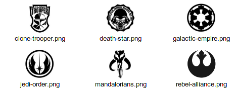
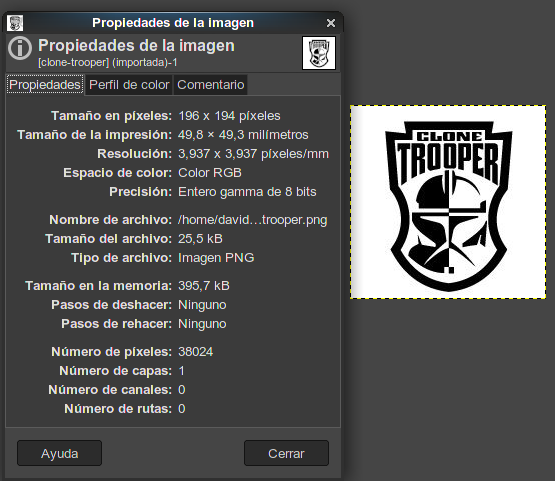
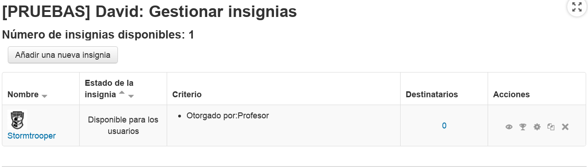

# Insignias

Las insignias es una forma de dar un "reconocimiento" a nuestros/as alumnos/as. Puede servir de "feedback" para el alumno.

Veamos cómo las podemos usar.

---

# Las imágenes

Las insignias podemos verlas como si fueran "medallas" que damos a alguien a modo de reconocimiento por su labor. Pues primero necesitamos conseguir algunas imágenes para que nos sirvan de insignias.

Estas son mis imágenes de ejemplo:

> 

Es importante tener en cuenta el tamaño y los colores de la imagen escogida como insignia. En mi caso las imágenes tienen tamaño 194x194 píxeles y estoy usando 2 colores.

> 
>
> Las propiedades de tamaño y color de una imagen se pueden modificar con programas como "paint" de Windows y/o el editor GIMP de software libre.

* Descargar/obtener imágenes, y guardarlas en una carpeta para estar organizados.

---

# Añadir insignia

* Ir a nuestro curso de pruebas Moodle.
* Ir a  `Administración -> Insignias -> Añadir nueva insignia`.
* Rellenamos formulario con:

| Campo       | Valor        | Explicación |
| ----------- | ------------ | ----------- |
| Nombre      | Stormtrooper | Nombre corto que nos sirva para identificar nuestra insignia |
| Descripción | Actitud positiva en clase. Trabajador y buen compañero. | Significado que le estamos asignando a nuestra insignia |
| Imagen      | _(Seleccionar una imagen)_ ||
| Detalles del emisor -> Nombre | Equipo educativo | Identificar al responsable de asignar las insignias |
| Caducidad   | 1 de julio 2019 |.|

* `Crear insignia`.
* En el desplegable `Añadir criterio para asignar insignia` escoger `Concesión manual por rol`.
* Elegir el rol `profesor`.
* `Guardar`

La insignia está creada pero todavía no se puede usar para ello hay que habilitarla. Una vez que lo hagamos no se puede modificar, entonces es importante revisarla antes de habilitarla.

* `Habilitar acceso`
* `Continuar`

---

# Gestionar insignia

* Ir a nuestro curso de pruebas Moodle.
* Ir a  `Administración -> Insignias -> Gestionar insignias`.

> 

En esta pantalla podemos hacer las siguientes acciones: Deshabilitar, **otorgar**, editar, copiar y borrar.

* Ir a `Acciones -> otorgar` (Trofeo).
* Seleccionar los alumnos que recibirán la insigna.
* `Otorgar insignia`.

¡Ya está! Si volvemos al menú de gestión de insignias veremos que ha sido otorgada (Destinatarios).

Los alumnos cuando entren al Moodle en su ficha (datos personales) verán que se les aparecen las insignias que vayan recibiendo.
