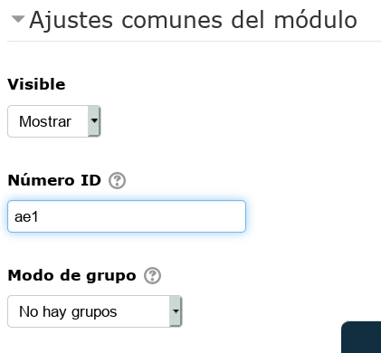
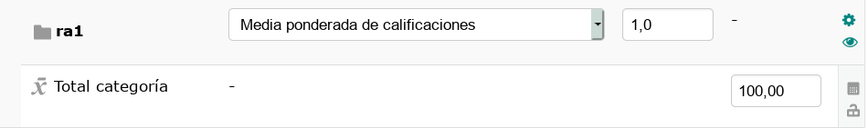
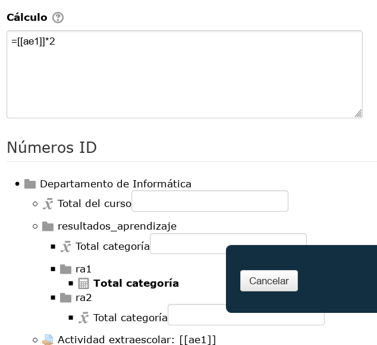

# Fórmulas

Hemos configurado el calificador para conseguir que Moodle nos calcule las notas de trim1, trim2, ud1, ud2, ud3, ud4, etc. usando la fórmula media ponderada.

Supongamos que queremos obtener otros valores diseñando nuestras propias fórmulas. Veamos un ejemplo donde configuraremos el calificador para calcula además, calificación de los resultados de aprendizaje.

---

# 1. Teoría: resultado de aprendizaje

_(Explicación sobre resultados de aprendizaje)_

---

# 2. Moodle: crear nuestro ejemplo

Vamos a crear un ejemplo como el siguiente:

| RA  | ud1 | ud2 | ud3 | ud4 |
| --- | --- | --- | --- | --- |
| ra1 | 100 |     |     |     |
| ra2 |  50 |     |  50 |     |
| ra3 |     |  33 |  33 |  34 |

## 2.1 Poner los ID a cada elemento de la fórmula

Debemos hacer lo siguiente:
* Ir a la categoría ud1 y ponerle ID ud1.
* Ir a la categoría ud2 y ponerle ID ud2.
* Ir a la categoría ud3 y ponerle ID ud3.
* Ir a la categoría ud4 y ponerle ID ud4.
* etc.

> Veamos un ejemplo donde tenemos la tarea "Actividad Extraescolar1" y le ponemos como ID el valor "ae1"
>
> 

Los ID's son necesarios para identificar los elementos que vamos a usar dentro de nuestra fórmula. Sigamos.

## 2.2 Crear categorías en el calificador

* Ir al `Configuración del calificador`
* Crear categoría `resultados_aprendizaje`, al mismo nivel que la categoría `curso`.
    * Fórmula `Media ponderada`
* Ahora crearemos dentro de `resultados_aprendizaje` las siguientes categorías: `ra1`, `ra2`, `ra3` y `ra4`.

> Para poder crear fórmulas en Moodle necesitaremos tener activa dicha funcionalidad. Debe aparecer al lado de la categoría un símbolo de una calculadora (Editor de fórmulas).
>
> 

## 2.3 Poner la fórmula

* Ir al `calificador`.
* Picar en la calculadora de `ra1`.
* En cálculo ponemos la siguiente fórmula: =[[ud1]]
* `Guardar`

> Ver ejemplo
>
> 

Seguimos poniendo fórmulas.
* Ir al `calificador`.
* Picar en la calculadora de `ra2`.
* En cálculo ponemos la siguiente fórmula: =([[ud1]]x50+[[ud3]]x50)/100
* Ir al `calificador`.
* Picar en la calculadora de `ra3`.
* En cálculo ponemos la siguiente fórmula: =([[ud2]]x33+[[ud3]]x33+[[ud4]]x34)/100

Comprobar los resultados obtenidos en al calificador de los valores de RA para cada alumno.

> Enlaces de interés:
> * https://docs.moodle.org/all/es/C%C3%A1lculos_de_calificaci%C3%B3n
> * https://si.ua.es/es/moodle/calificaciones/calculos-de-calificaciones.html
