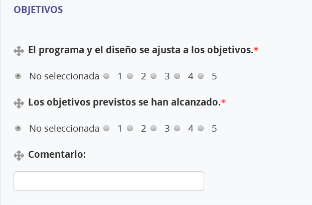

# Encuestas

Las encuestas no son cuestionarios, ni son exámenes tipo test.

Las encuestas son baterías de preguntas que nos sirven para recopilar información sobre el alumnado. Son muy útiles por ejemplo para obtener información sobre conocimientos previos.

---

# Ejemplo: Cómo crear una encuesta

Vamos a ver un ejemplo, en el que crearemos un "cuestionario de valoración" usando las encuestas de Moodle.

* Ir a nuestro curso de pruebas.
* `Activar edición`
* Ir a la última caja.
* `Agregar encuesta`.

> Por si no te habías fijado... la encuesta se puede usar como una actividad evaluable.

* Rellenamos el formulario con:

| Campo       | Valor                       |
| ----------- | --------------------------- |
| Nombre      | Encuesta - Valoración final |
| Descripción |  |
| Registrar nombres de usuario | anónimo |
| Permitir múltiples envíos    | no |

* `Guardar cambios y mostrar`.
* Vamos a la pestaña `Editar preguntas`, para empezar a crear las preguntas de la encuesta.
* Añadir pregunta de tipo `Etiqueta`.
    * Contenido: `Valore de 1 a 5 los siguientes aspectos (1=Total desacuerdo, 2=Desacuerdo, 3=Término medio, 4=De acuerdo, 5=Muy de acuerdo). Si la valoración es 2 ó 1, por favor comente su puntuación.`
    * `Guardar pregunta` (¡Lo sé! No es una pregunta es un texto/etiqueta)
* Añadir pregunta de tipo `Etiqueta`.
    * Contenido: `OBJETIVOS` (En negrita).
    * `Guardar pregunta`
* Añadir pregunta de tipo `Elección múltiple`.
    * Obligatorio: `Sí`
    * Pregunta: `El programa y el diseño se ajusta a los objetivos.`
    * Tipo elección múltiple: `1 respuesta`
    * Ajuste: `horizontal`.
    * Valores de elección: `1`, `2`, `3`, `4`, `5` (Usaremos una línea por cada respuesta)
    * `Guardar pregunta`
* Añadir pregunta de tipo `Elección múltiple`.
    * Obligatorio: `Sí`
    * Pregunta: `Los objetivos previstos se han alcanzado.`
    * Tipo elección múltiple: `1 respuesta`
    * Ajuste: `horizontal`.
    * Valores de elección: `1`, `2`, `3`, `4`, `5`
    * `Guardar pregunta`
* Añadir pregunta de tipo `Respuesta corta`.
    * Obligatorio: `No`
    * Pregunta: `Comentario:`

> Veamos cómo va quedando:
>
> 

Seguiríamos así, hasta terminar todas las preguntas.

---

# Tarea: Encuesta

* Crea una encuesta con el nombre `Conocimientos previos` en la caja 0 de tu curso de pruebas Moodle.
* Añade 5 preguntas a la encuesta, que te sirvan para averiguar los conocimientos previos del alumnado en relación a tu asignatura.
