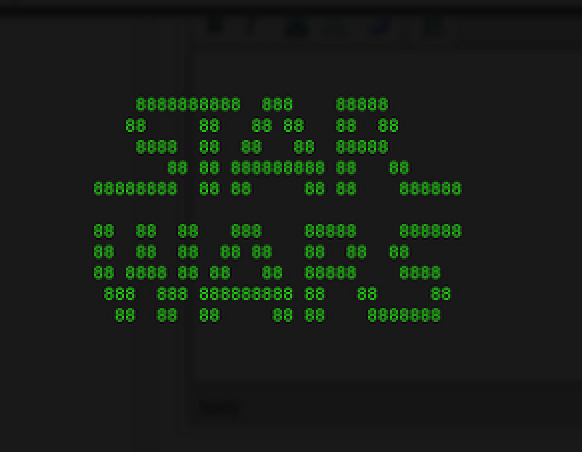
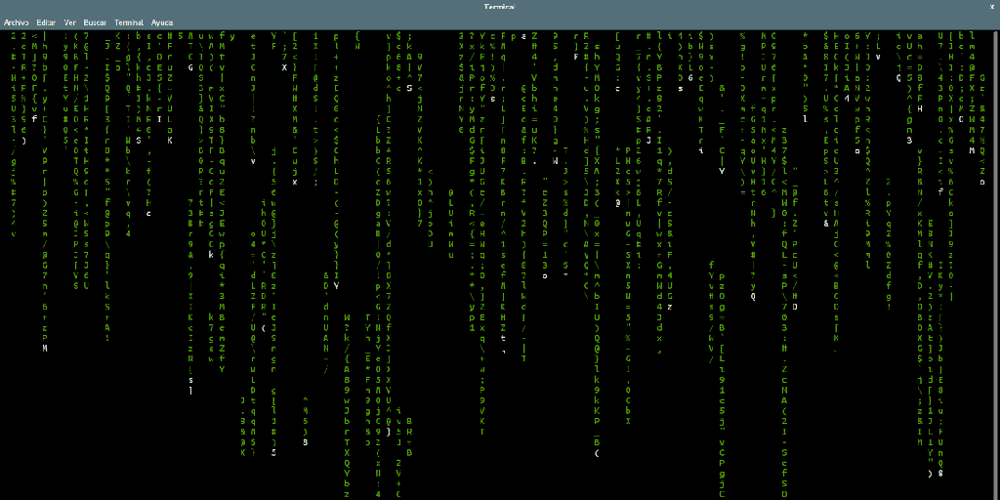
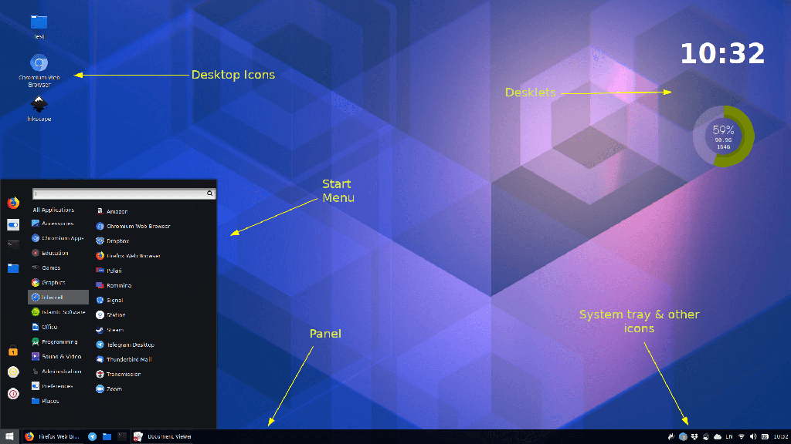
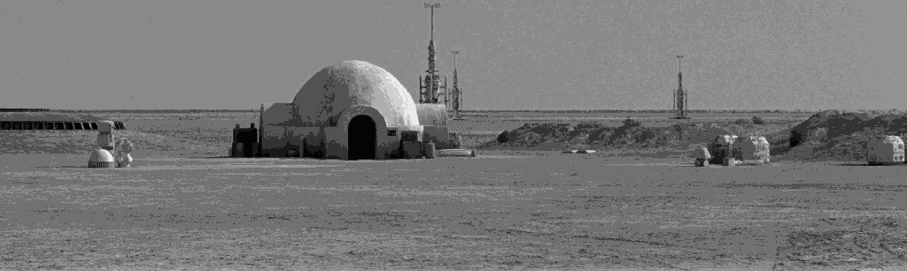
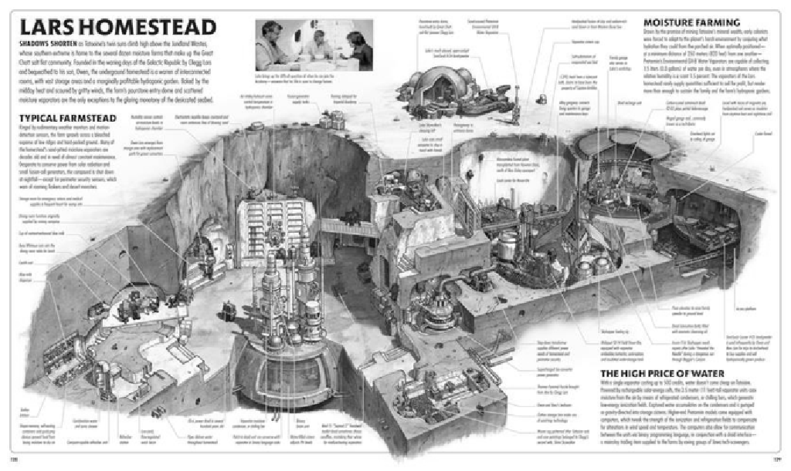

# Episodio 00000100b: Una Nueva Esperanza

_"Hace mucho tiempo en una plataforma muy, muy remota..."_



```
Nos encontramos en un
periodo de revueltas. Las
aplicaciones hacker,
se instalan desde repositorios
libres, han logrado su
primera victoria contra
el malvado "Darth Vendor-Locking".

Mediante ingeniería inversa, los
programadores hacker han
conseguido descifrar los protocolos
de "Darth Vendor-Locking".

Perseguida por los siniestros
agentes del copyright,
la developer "Adha Lhower" trata
de conectarse en remoto a su servidor,
usando SSH, para copiar la información
descifrada, que puede salvar su plataforma
y devolver la libertad al software
de toda Internet.
```

> ¡Si! Lo admito. Esto es una _frikada_.

---

# 1. Software Libre en StarWars

```
Human: ¿De verdad? ¿Vas a hablar de eso? Pufff
       Vamos a ver por curiosidad a ver cómo la pifias...
```

Probabilidades de NO "pifiarla":

| Software libre | Starwars | Ponente | Probabilidad |
| -------------- | -------- | ------- | -------------|
| Like           | Dislike  | Dislike |  33%         |
| Like           | Like     | Dislike |  66%         |
| Like           | Dislike  | Like    |  66%         |
| Like           | Like     | Like    | 100%         |

## 1.1 Qué, quién, cómo, cuándo, dónde, por qué...

```
No-goto-san: ¿Por qué estás haciendo esto?
self: porque me hace feliz!
```

_Voy a unir todo lo que me gusta y... a ver qué sale._

```ruby
felicidad = [ :starwars, :software, :libre ]
```

---

# 2. Empezamos

```ruby
felicidad[0] # => starwars
```

> AVISO: Puede contener spoilers de StarwWars.

## 2.1 Razonamiento

1. Starwars es ciencia ficción.
2. Tienen tecnología... más "avanzada" que la nuestra.
3. Por tanto hay: hardware y software.

> La pregunta es: _¿Cómo es ese software?_


# Aclaración: somos gente normal

¿Qué creemos que es el software libre?



¡No!... Esto es lo que es...



Gente de todo tipo. Con vidas normales. No tod@s somos hackers(Jedis) y crackers(Siths).


Imaginemos un granjero...



Dentro de nuestras casas hay mucha tecnología... que no tenemos por qué conocer. Para eso están los expertos: electricistas, fontaneros, etc.


