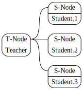

# TEUTON: Test de infraestructura

```
Fecha : Viernes 24
Lugar : Sala Núñez
Hora  : 10:30-10:55
```


# 2. Agradecimientos

¡Muchas gracias!
* Organización **EsLibre22**
* Equipo Teuton Software
* Comunidad Teuton de Telegram

`Todo lo que vamos a ver está hecho con Software Libre`

# 3. Presentación

* David Vargas
* GitHub: **@dvarrui**
* Ruby, software libre y StarWars.


# 4. Teuton

¿Qué es?
* Programa multiplataforma.
* Licencia Software libre.
* Test de infraestructura.

¿Qué resuelve?
1. Revisar nuestra infraestructura como si fuera código.
2. Automatizar las correcciones de las MV remotas de los alumnos.

# 5. TDD

Defnición
* **Desarrollo guiado por pruebas de software**.
* Lograr un código limpio que funcione.
* Garantizar que el software cumple con los requisitos que se han establecido.

```
=> "Clean Code"        Robert C. Martin
=> "Código sostenible" Carlos Ble
```

# 6. Ejemplo: Factorizar


```ruby
module MyMath
  def self.factorize(number)
    factors = []
    divisor = 2
    while(number > 1)
      while (number % divisor).zero?
        factors << divisor
        number /= divisor
      end
      divisor += 1
    end
    return factors
  end
end
```

# 7. Ejemplo: test_factorize


```ruby
require 'test/unit'
require_relative 'mymath.rb'

class TestFactor < Test::Unit::TestCase
  def test_factorize_34
    assert_equal [2, 17], MyMath.factorize(34)
  end
end
```

# 8. Concurso de programación


# 9. QA

Aplicar **tests para mantener la calidad** de...
* Mi código.
* ¿Mi infraestructura?
* ¿Mis scripts?


# 10. Instalar Teuton

Instalar TEUTON:
* Instalar Ruby
* `gem install teuton`, instalar la gema


# 11. Test local

Target/run/expect

# 12. DSL sencillo

# 13. Test remoto



12. Ejemplo: usuarios/carpetas/software
13. Resultados

14. Test remoto
15. Resultados
16. ¿qué más se puede hacer?
17. URLs: Más tests y documentación
18. _
19. _
20. Gracias / datos de contacto
