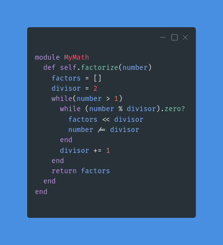
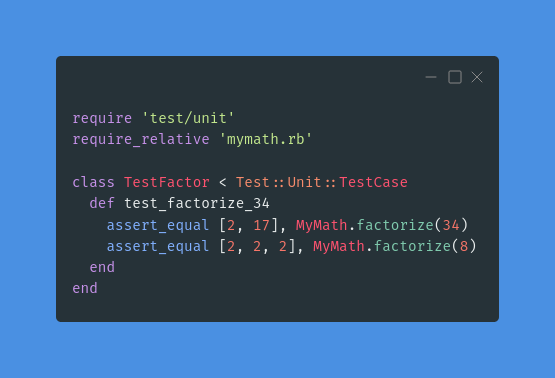
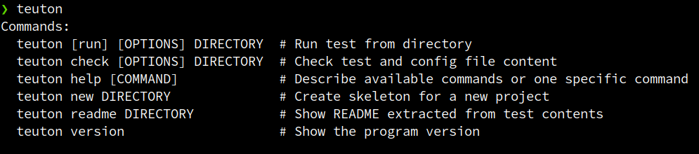
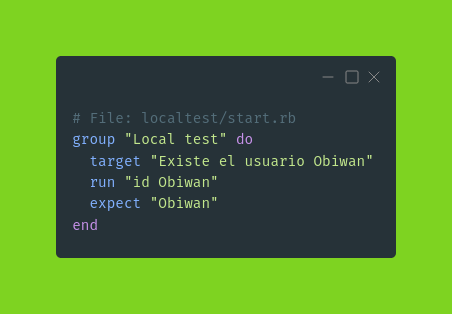
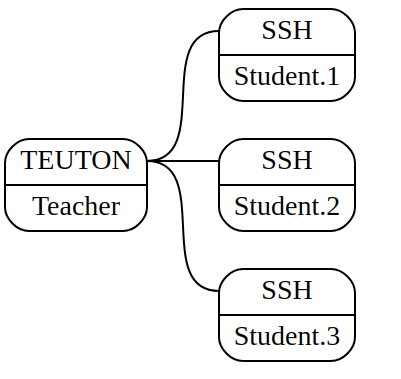
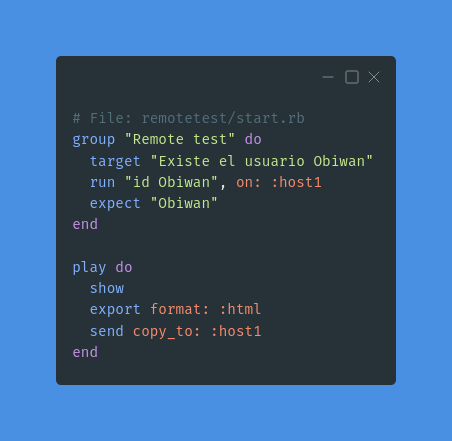

# TEUTON: Test de infraestructura

```
Fecha : Viernes 24
Lugar : Sala Núñez
Hora  : 10:30-10:55
```


# 2. Agradecimientos

* Organización **EsLibre22**
* Equipo Teuton Software
* Comunidad Teuton de Telegram

```
Todo lo que vamos a ver está hecho con Software Libre
```

# 3. Presentación

* David Vargas
* GitHub: **@dvarrui**
* Ruby, software libre y StarWars.


# 4. Teuton

¿Qué es?
* Programa multiplataforma.
* Licencia Software libre.
* Test de infraestructura.

¿Qué resuelve?
1. Revisar nuestra infraestructura como si fuera código.
2. Automatizar las correcciones de las MV remotas de los alumnos.

# 5. TDD

* **Desarrollo guiado por pruebas de software**.
* Lograr código limpio que funcione.
* **Garantizar** que el software **cumple con los requisitos** que se han establecido.

```
=> "Clean Code"        Robert C. Martin
=> "Código sostenible" Carlos Ble
```

# 6. Ejemplo: Factorizar



```ruby
module MyMath
  def self.factorize(number)
    factors = []
    divisor = 2
    while(number > 1)
      while (number % divisor).zero?
        factors << divisor
        number /= divisor
      end
      divisor += 1
    end
    return factors
  end
end
```

# 7. Ejemplo: test_factorize



```ruby
require 'test/unit'
require_relative 'mymath.rb'

class TestFactor < Test::Unit::TestCase
  def test_factorize_34
    assert_equal [2, 17], MyMath.factorize(34)
  end
end
```

# 8. Concurso de programación


# 9. QA

Aplicar **tests para mantener la calidad** de...
* Mi código.
* ¿Mi infraestructura?
* ¿Mis scripts?


# 10. Instalar Teuton

* Instalar Ruby
* `gem install teuton`, instalar la gema



# 11. Test local



Para ejecutar el test hacemos:
```
teuton localtest
```

# 12. DSL sencillo

* **target**: Descripción del objetivo
* **run**: Comando que ejecutamos para comprobar.
* **expect**: Lo que esperamos "ver" en la salida del comando anterior.

```
1) Si sabes qué comando usar para comprobar el target...
2) Y sabes que debes "mirar" en la salida del comando...
¡Ya tienes el test!
```

> https://github.com/dvarrui/teuton-tests

# 13. Equipos remotos



* Un host con TEUTON instalado.
* El resto con SSH para poder acceder.

# 14. Test remoto

¿Existe el usuario "Obiwan" en los equipos remotos?


Para ejecutar el test hacemos:
```
teuton remotetest
```

# 15. Configuración de los hosts


```
# File: remotetest/config.yaml
---
global:
  host1_username: root
cases:
- tt_members: Student-1
  host1_ip: 192.168.1.101
  host1_password: secret1
- tt_members: Student-2
  host1_ip: 192.168.1.102
  host1_password: secret2
- tt_members: Student-3
  host1_ip: 192.168.1.103
  host1_password: secret3
```

# 16. Generar informes



```
play do
  show
  export format: :html
  send copy_to: :host1
end
```

# 17. Expect

```
expect 'obiwan', expect line/s with "obiwan".
expect ['obiwan', 'kenobi', expect line/s with "obiwan" and kenobi".
expect_one 'obiwan', expect only one line with "obiwan".
expect_one ['obiwan','kenobi'], expect only one line with "obiwan" and "kenobi".
expect_none 'obiwan', expect no line with "obiwan".
expect_none ['obiwan', 'kenobi'], expect no line with "obiwan" and "kenobi".
expect /Obiwan|obi-wan/, Expect line/s with Obiwan or obi-wan. This example uses regular expresions.
```

```ruby
target 'Exist user vader'
run    'cat /etc/passwd'
```

```
expect result.find("vader").count.eq(1), expect there exists only 1 line with "vader" text.
expect result.find(/Darth|darth/).find(/Vader|vader/).count.gt(2), expect there exists more than 2 lines with texts "Darth" and "Vader".
expect result.not_find('#').find('vader').count.lt(3), expects there exists less than 3 lines with text "vader" and without "#" symbol.
```

# 18. URLs

* GitHub y docs: https://github.com/teuton-software/teuton
* Rubygems: https://rubygems.org/gems/teuton
* Ejemplos: https://github.com/dvarrui/teuton-tests

# 19. Muchas Gracias

* **Email**: teuton.software@protonmail.com
* **Telegram**: "TEUTON Software"
* **GitHub**: @teuton-software, @dvarrui
