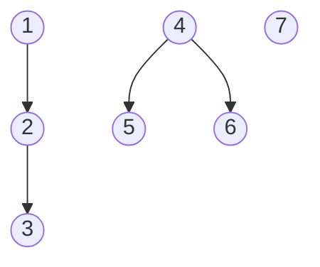

# Grafos

```
A partir de un grafo y sus arcos, vamos a calcular:
* las componentes conexas del grafo si los arcos se consideran no dirigidos
* las componentes fuertemente conexas de un grafo si los arcos se consideran dirigidos

Vamos a usar perspectiva didáctica, usando el lenguaje de programación Ruby
```

# 1. Definiciones

* Nodo
* Arco
* Grafo: dirigido, no dirigido
* Componente conexa
* Componente fuertemente conexa
* Algoritmos conocidos

# 2. Fichero de entrada

* [Ejemplos](./data/) de ficheros de entrada.

Los ficheros de entrada, son ficheros de texto plano con el siguiente formato:

* En la primera fila, el número de nodos del grafo. Si por ejemplo, tenemos un grafo de 4 nodos, entonces los nodos se identifican como 1, 2, 3, y 4.
* En las filas restantes (de 0 a un valor no determinado) definiremos los arcos.
* Cada arco se define en una fila con dos valores numéricos `N1 N2`:
    - El primer número N1 es el identificador del nodo de donde parte el arco. El origen del arco.
    - En segundo número N2 es el identifcador del nodo hacia donde se dirige el arco. El destino del arco.
* Aunque en el fichero de entrada los arcos se definen con dirección. Internamente en la implementación, tendremos en cuenta o no la dirección de los arcos según nos interese en cada momento.

* Contenido del fichero `data/grafo1.txt`:

```text
7
1 2
2 3
4 5
4 6
```

* Esquema del grafo:


